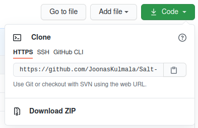
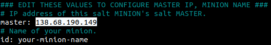
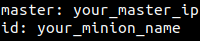

# Salt My Ubuntu

- [Salt My Ubuntu](#salt-my-ubuntu)
  - [Installing salt minion](#installing-salt-minion)
    - [Automatic install](#automatic-install)
    - [Manual install](#manual-install)
      - [APT repository](#apt-repository)
      - [Installing salt minion](#installing-salt-minion-1)
      - [Configuring your minion](#configuring-your-minion)

**Salt My Ubuntu** is an automated process to setup a salt minion on Linux Ubuntu 20.14.

Learn more about the [Salt Project](https://docs.saltproject.io/en/latest/topics/about_salt_project.html), how to perform [Installation](https://docs.saltproject.io/en/latest/topics/installation/index.html) on your system and [Configuring the Salt Minion](https://docs.saltproject.io/en/latest/ref/configuration/minion.html).

## Installing salt minion

Before installing please see `USER GUIDE` and edit the necessary files.

Either use the command **git clone** or download and extract the `.zip` package of the repository.

	$ git clone https://github.com/JoonasKulmala/Salt-My-Ubuntu.git

By default only `minion` needs to be configured; IP address of salt master must be added.

### Automatic install

To install and configure the salt minion automatically run the bash script `install` located in `/Salt-My-Ubuntu/install`:

    $ bash install

### Manual install

If you are unable to run the bash script, encounter errors or wish to do the necessary steps manually, here are the steps to perform the installation manually.

Here is SaltStack's [documentation](https://repo.saltstack.com/#ubuntu) on how to perform the installation. 

#### APT repository

To install salt minion, SaltStack repository key & source list must be added:

    # Download key
    $ sudo curl -fsSL -o /usr/share/keyrings/salt-archive-keyring.gpg https://repo.saltproject.io/py3/ubuntu/20.04/amd64/latest/salt-archive-keyring.gpg
    # Create apt sources list file
    $ echo "deb [signed-by=/usr/share/keyrings/salt-archive-keyring.gpg] https://repo.saltproject.io/py3/ubuntu/20.04/amd64/latest focal main" | sudo tee /etc/apt/
    sources.list.d/salt.list

#### Installing salt minion

After adding the repository you can install salt minion using APT:

    $ sudo-apt get update
    $ sudo-apt get install salt-minion

#### Configuring your minion

Now the salt minion must be configured by modifying `/etc/salt/minion`. Either: 
* copy this [minion](minion) file or its contents
* add the values:
  * master: your_master_ip
  * id: your_minion_name

  
Finally, restart the salt minion service to connect with your salt master:

    $ sudo systemctl restart salt-minion

Your salt minion is now ready, provided its salt master is configured properly.

